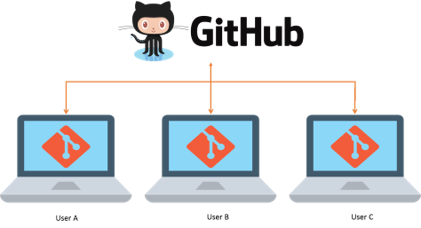
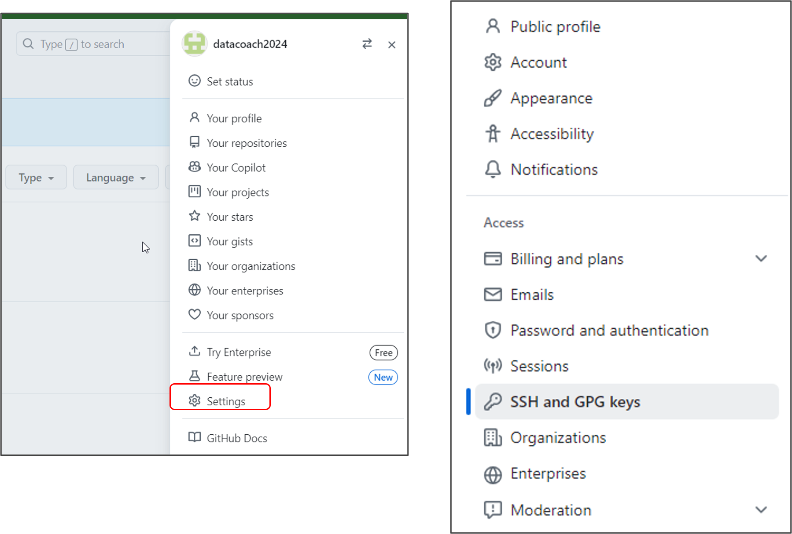
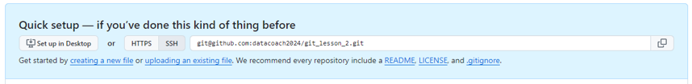
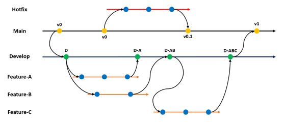

# Совместная работа в Github и ветвление в `git`  

## Работа с Github  

**GitHub** — платформа для хранения IT-проектов и совместной работы над ними с использованием Git. По сути, это сайт, куда можно загрузить файлы своего проекта для обмена с другими людьми.  



### Что такое SSH  
Когда компьютеры обмениваются данными в сети, они следуют сетевым протоколам (англ. network protocols) — правилам обмена данными между компьютерами.
Один из наиболее распространённых сетевых протоколов — SSH (от англ. Secure Shell Protocol). Он обеспечивает безопасный обмен данными в сети. С помощью этого протокола можно получать данные с удалённого компьютера или отправлять их на него. Трафик шифруется, поэтому протокол безопасен.
SSH использует пару ключей для обеспечения безопасности — публичный и приватный: 
Приватный ключ (англ. private key) хранится только на вашем компьютере и не должен передаваться кому-либо ещё. Он используется для расшифровки данных.
Публичный ключ (англ. public key) доступен всем и используется для шифрования данных. Они могут быть расшифрованы парным приватным ключом.
Только вы можете расшифровать данные с помощью приватного ключа, но любой владелец публичного ключа может их для вас зашифровать. Эти два ключа связаны и образуют SSH-пару. В будущем вы наверняка будете использовать их для взаимодействия с GitHub и другими удалёнными серверами.

* **ls -la ~/.ssh/** - проверка наличия SSH ключей;  
* **ssh-keygen -t ed25519 -C "the email to which your Github is linked"** - команда для генерации SSH-ключа;  

### Кодовая фраза
Многие пользователи Git не используют кодовую фразу для защиты своего SSH-ключа. Если такой фразы нет, то её не нужно вводить всякий раз при взаимодействии с удалённым репозиторием.
С другой стороны, применение кодовой фразы усиливает безопасность ключей. Если вы используете эту фразу, ключ будет надёжно защищён в случае несанкционированного доступа к вашему компьютеру.  

### Привязываем SSH-ключ к Github  
```clip < ~/.ssh/id_ed25519.pub``` - копируем содержимое ключа в буфер обмена  
В Github переходим в *Settings/SSH and GPG keys/New SSH key*. В поле *Title* пишем название ключа, в поле *Key type* выбираем *Authentication key*, и в поле *Key* вставляем содержимое буфера обмена. Нажимаем *Add SSH key*.  



```ssh -T git@github.com``` - проверяем правильность ключа.  

### Связываем локальный и удалённый репозиторий  

1. Перейдите на страницу удалённого репозитория, выберите тип SSH и скопируйте URL. Кнопка справа позволит сделать это мгновенно.  



2. Откройте консоль, перейдите в каталог локального репозитория и введите команду git remote add (от англ. remote — «удалённый» и add — «добавить»). Команде необходимо передать два параметра: имя удалённого репозитория и его URL. В качестве имени используйте слово origin. А URL вы скопировали со страницы удалённого репозитория.  
    ```  
    cd my_project  
    git remote add origin git@github.com:%ИМЯ_АККАУНТА%/my_project.git 
    ```
> для вставки значения из буфера обмена в командную строку используйте сочетание клавиш `Ctrl+Shift+V`  

```git remote -v``` - проверяем что репозитории связались  

### Отправление изменений на удалённый репозиторий  
**git push** - команда загружающая содержимое локального репозитория на Github   
В первый раз эту команду нужно вызвать с флагом -u и параметрами origin (имя удалённого репозитория) и main или master (название текущей ветки). Флаг -u свяжет локальную ветку с одноимённой удалённой. Как вы связывали локальный и удалённый репозитории в предыдущем уроке, так же и здесь нужно дополнительно связать ветки.  
    ```git push -u origin main #если команда приведёт к ошибке попробуйте заменить main на master```

## Ветки: создание, навигациия и сравнение  
### Что такое ветка  
**Ветка** - это изолированный поток разработки проекта. В таком потоке можно проверять разные идеи, тестировать новую функциональность и так далее. Ветки позволяют экспериментировать с проектом в Git, но при этом сохранять репозиторий в стабильном состоянии.  



Посмотреть список существующих веток проекта можно с помощью команды `git branch`.  

### Создаём ветку  
Для создания веток в Git есть команда `git branch <branch_name>`
> Название ветки в Git может состоять из букв, цифр, а также включать любой из четырёх символов: `.`, `-`, `_`, `/`. Эти символы не несут особого смысла.  

### Шагаем с ветки на ветку  
* команда `git checkout <branch_name>` позволяет переключаться на другую ветку;  
* разные ветки в одном проекте существуют независимо. Изменения в одной не влияют на изменения в другой;  
* в Git можно создать ветку и сразу же перейти в неё командой `git checkout -b <branch_name>`;  
* ветка указывает на коммит, который сделан в ней последним. При этом две ветки могут ссылатться на один и тот же коммит - например, если вы только что создали ветку, но ещё не успели внести в неё коммит.  

### Сравниваем ветки  
* `git diff` может сравнивать ветки по их названиям. Например, команда `git diff main feature/my_feature` выведет разницу между основной веткой и веткой `feature/my_feature`;  
* Git поддерживает суффикс навигации `~`. С его помощью можно сослаться на предыдущие коммиты. Например, если вы находитесь в ветке `main` и хотите вывести разницу между тем коммитом, который был три коммита назад, и текущим, нужно выполнить `git diff main~3 main`.  

### Слияние и удаление веток  
* выполнить слияние веток позволяет команда `git merge <branch_name>`. В качестве параметра указывают название ветки, которую нужно "влить" в текущую;  
* удалять ненужные ветки после слияния - хорошая практика. Так в вашем репозитории всегда будет порядок. За удаление веток отвечает команда `git branch -D <branch_name>` и её щадящий вариант с флагом `-d`. Этот вариант удалит ветку, только если она была полностью объединена с другой - то есть если две ветки стали (или изначально были) частью одной истории.  

## Копирование репозиториев  
### Клонирование репозитория  
**Клонирование** - процесс копирования удалённого репозитория на локальный компьютер.  
Процесс клонирования репозитория:  
1. переходим на страницу репозитория и нажимаем на зелёную кнопку `Code`.
2. в появившемся окне  переходим на вкладку `SSH` и копируем ссылку.
3. открываем консоль, переходим в папку, в которую хотим положить репозиторий и выполняем команду  
```git clone https://github.com/yandex-praktikum/git-clone-lesson```  
4. убедитесь что репозитории связаны, с помощью команды `git remote -v`  

### Выполняем Fork  
**Fork** - это GitHub операция, которая создаёт копию репозитория в аккаунте GitHub. Такая копия будет полностью независима. Изменения, которые вы внесёте, не будут синхронизированы с исходным репозиторием.  
В процессе "форка" создаётся копия всех файлов, истории коммитов и веток. Эта копия сохраняется в вашей учётной записи GitHub.  
Вот некоторые из распространённых причин использования "форков":  
* вы хотите внести свой вклад в проект (например open source), но не имеете прав на изменение исходного репозитория. Тогда вы можете сделать "форк", добавить нужные правки, а затем отправить запрос на включение этих изменений в оригинальный проект;  
* вы хотите развивать проект независимо от исходного. Допустим, создатели проекта решили, что не будут добавлять функциональность, которая вам необходима. В таком случае вы можете сделать "форк" и добавить её самостоятельно.  