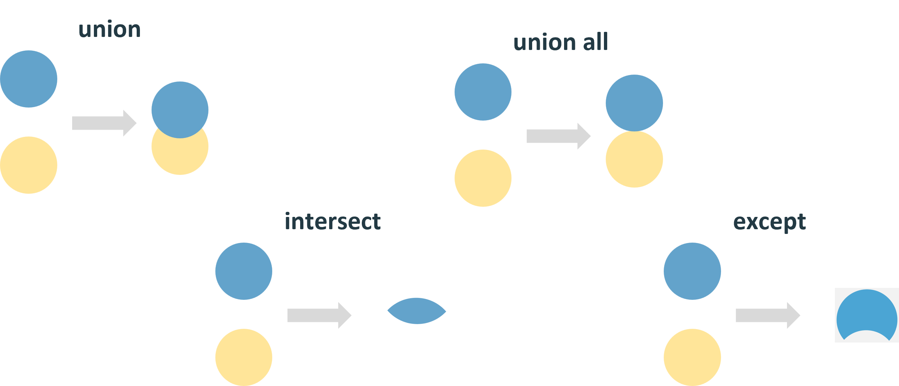

# Джойны и сочетания запросов  
## Джойны
**Джойн** это операция, которая объединяет две или более таблицы в одну на основе общих значений.  

Существуют различные типы джойнов, включая:  
• `left join` - все записи из левой таблицы и соответствующие записи из правой таблицы.  
• `right join` - все записи из правой таблицы и соответствующие записи из левой таблицы.  
• `inner join` - только записи, которые соответствуют в обеих таблицах.  
• `full [outer] join` - все записи из обеих таблиц.  


Синтаксис джойнов выглядит следующим образом:
```sql
select *
from table1 t1
    [left|right|inner|outer|cross] join table2 t2
        on t1.some_column = t2.some_column
        [and t1.another_column = t2.another_column]
```

Есть и другие типы джойнов:  
• **Self join** - таблица объединяется сама с собой.  
• **Anti join** - строки из левой таблицы, для которых нет совпадений в правой таблице.  
• **Semi join** - только столбцы из левой таблицы, без совпадений строк, и одно вхождение, даже если для левой таблицы существует несколько записей в правой, это не приводит к дубликатам.  

Джойны по типу сравнения:  
• **Equi join** - в сравнении используется только знак равенства.  
• **Non-equi join** - в сравнении используется не только знак равенства.  

## Сочетания запросов  

Существуют различные типы сочетаний:  
• `union` - объединяет результаты двух запросов, удаляя дубликаты.  
• `union all` - объединяет результаты двух запросов, включая дубликаты.  
• `intersect` - возвращает общие строки из двух запросов.  
• `except` - возвращает строки из первого запроса, которых нет во втором запросе.  



При использовании сочетаний запросов необходимо соблюдать следующие правила:  
• Каждый подзапрос должен содержать одинаковое количество столбцов.  
• Столбцы во всех подзапросах должны идти в одинаковом порядке.  
• Соответствующие столбцы в каждом из подзапросов должны быть одинакового типа данных.