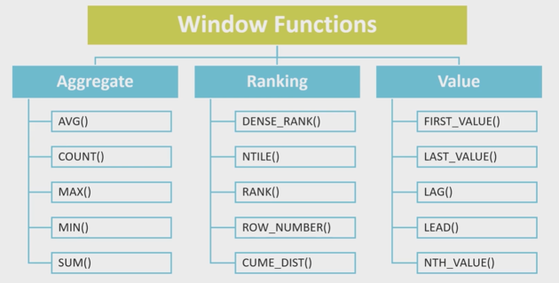
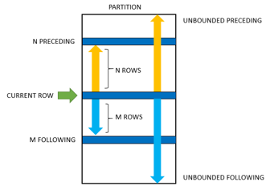

# Оконные функции  
**Оконные функции** — это мощный инструмент в SQL, который позволяет выполнять сложные аналитические операции над данными без необходимости группировки данных. Они позволяют производить вычисления по "окну" строк, связанному с текущей строкой, при этом сохраняя отдельные строки в результирующем наборе. В отличие от агрегатных функций (например `sum`, `avg`), которые сворачивают результаты в одну строку для каждой группы, оконные функции позволяют сохранять все строки таблицы, добавляя к ним дополнительные вычисляемые столбцы.  

Синтаксис оконных функций:  
```sql
<function>(...) over(
    [partition by <column_name>]
    [order by <column_name> [asc|desc]]
    [rows|range between <start> and <end>]
)
```  

где:  
`<function>(...)` - любая допустимая оконная или агрегатная функция  



`over` - ключевое слово, указывающее что мы используем оконную функцию  

`partition by` - разделяет данные на группы  

`order by` - определяет порядок строк внутри окна  

`rows/range between` - определяет рамки(frame) окна, то есть диапазон строк участвующих в вычислении  

  

Если `order by` указан, то по умолчанию рамки определяются как: ```range between unbounded preceding and current row```  

Если `order by` не указан, то по умолчанию рамки определяются как: ```rows between unbounded preceding and unbounded following```

