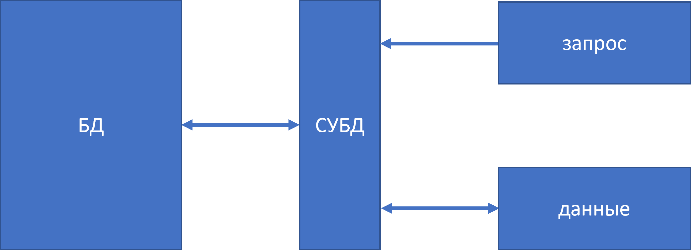
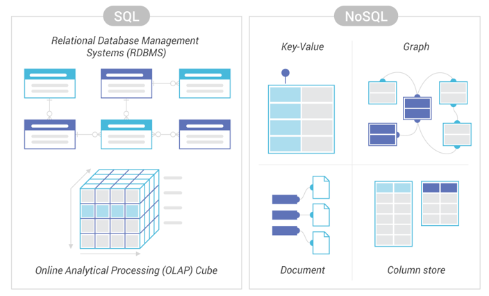
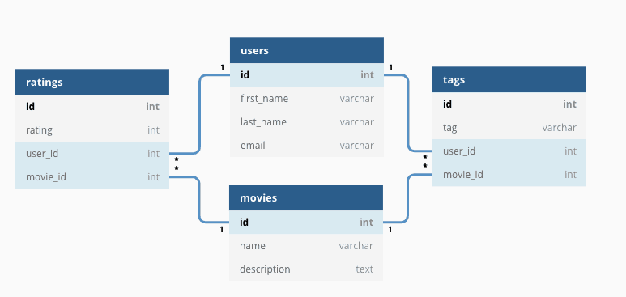

# Знакомство с базами данных и языком SQL  


## Базы данных  
На курсе вы до сих пор работали с данными читая их из файлов и записывая обратно в файлы. Но на практике, чаще всего, компании хранят свои данные не в разрозненных файлах а в базах данных.  

**Базы данных** - это организованная коллекция данных, которая позволяет удобно хранить, управлять и извлекать информацию.  

Основные функции баз данных:  
1. Хранение и управление данными  
2. Обеспечение быстрого доступа к данным  
3. Обеспечение целостности данных  
4. Многопользовательская среда  
5. Аналитика и отчёты  
6. Интеграция с другими системами  
7. Обеспечение безопасности данных  
8. Масштабируемость  

**СУБД** (Система Управления Базами Данных) - совокупность программных и лингвистических средств общего или специального назначения, обеспечивающих управление созданием и использованием баз данных.  

  

Базы данных делятся на **SQL** и **NoSQL**, где префикс "No" означает *not only*.  

  

**Реляционные БД** - старейший и самый широко используемый тип БД, где данные представлены в виде таблиц, связанных между собою ключами.  

  

Самые популярные реляционные БД:  
* Oracle  
* MySQL  
* MariaDB  
* PostgreSQL  
* SQLite  

## Знакомство с SQL
**SQL** - это декларативный язык, используемый для записи, чтения и обработки данных в реляционных БД.  
Изначально язык был назван *Structured English QUEry Language*, сокращённо *SEQUEL*. Но так как бренд под таким именем уже существовал, язык был позже переименован в *Structured Query Language*, сокращённо *SQL*. Тем не менее в англоязычной среде сохранилось изначальное название языка.  

Синтаксис языка SQL состоит из четырёх компонентов:  
* **DDL** в который входят такие команды как:    
    * create  
    * drop  
    * truncate  
* **DML** в который входят следующие команды:  
    * select  
    * insert  
    * update  
    * delete  
* **DCL** включающий следующие команды:  
    * grant  
    * invoke  
* **TCL** состоящий из следующих команд:  
    * commit  
    * rollback  
    * savepoint

## Базовые операторы  

Комментарии  
```SQL  
-- однострочный комментарий  

/*  
Многострочный комментарий  
*/

```  

Выборка данных оператором `select`  
```SQL  
select <expression>  
from <table>  
[where <conditions>]  
[order by <expressions> [asc|desc]];
```  

### Стиль и форматирование  
Для СУБД неважно как выглядит ваш код. Но с кодом работает не только машина, но и человек. Это может быть ваш коллега, которому нужно разобраться в вашем коде, или же даже вы сами, когда пытаетесь понять что делает код, который вы написали месяц назад или пытаетесь переиспользовать существующий код для новой задачи. Поэтому ваш код должен быть:  
    * читабельным  
	* удобным для отладки    

Правила "хорошего тона" при написании SQL-скриптов:  
    * ключевые команды, такие как `select`, `from`, `where` и т.д. нужно писать с новой строки  
    * если в запросе идёт перечисление (например перечисление названий столбцов), то каждый из элементов должен быть в новой строке  
    * при перечислении, запятая должна стоять в начале строки а не в конце  

Во всех учебниках по SQL до сих пор говорится что ключевые слова должны писаться в верхнем регистре. Но это требование является анахронизмом, поскольку:  
	* слова в верхнем регистре трудно печатать и трудно читать;  
	* большинство современных компьютерных языков используют нижний регистр;  
	* современные редакторы поддерживают подсветку синтаксиса;  

### Поля и псевдонимы  
Поля выгружаются в том порядке, в котором они перечислены в запросе.  

Если нужно выгрузить все поля таблицы, то после ключевого слова `select` можно поставить символ `*`. Однако при работе с реальными таблицами *не рекомендуется это делать*, поскольку реальные таблицы могут иметь большое количество столбцов и не все из них вам нужны. Кроме того, чем больше столбцов вы указываете в своём запросе, тем больше времени ваш запрос будет обрабатываться.  

При необходимости, можно сократить названия полей или сделать их более удобочитаемыми переименовывая их с помощью псевдонимов или *элиасов*, используя ключевое слово `as`.  
```SQL
select
    col1 as first_column
from tbl;
```  

### Математика в SQL  
Если поля содержат числовые значения, то с ними можно производить математические операции с помощью операторов `+`, `-`, `/`, `*`, `^`, `%`.  

В SQL при делении целых чисел возвращается целое число. Чтобы деление возвращало дробное число, нужно одно из элементов деления сопроводить *плавающей точкой*.  
```SQL
select 8 / 3.
```  

Для округления числовых значений в SQL используется функция `round`.  
```SQL
select round(8 / 3., 2)
```  

### Сортировка и лимиты  
Для сортировки в SQL используется оператор `order by`. По умолчанию он сортирует значения по возрастанию. Для сортировки по убыванию к `order by` добавляется ключевое слово `desc`.  
```SQL
select *
from tbl
order by col1 desc  
```  

Ограничить количество выгружаемых строк можно с помощью оператора `limit`.  
```SQL
select *
from tbl
limit 20
[offset 10]
```  

### Фильтрация и комбинирование условий  
Для фильтрации данных в SQL используется оператор `where`.  
```SQL
select *
from tbl
where
    <conditions>
```  

Можно комбинировать несколько условий фильтрации с помощью операторов `and` и `or`.  
```SQL
select *
from tbl
where
    condition1 and|or condition2
```  

В условиях могут использоваться операторы сравнения `=`, `!=`, `>`, `<`, `>=`, `<=`.  
```SQL
select *
from tbl
where
    col1 between x and y
```  

Оператор `in` проверяет соответствует ли проверяемое значение хотя бы одному из многочисленных вариантов.  
```SQL
select *
from tbl
where
    col1 in (x, y, z)
```  

### Фильтрация пустых значений  
В таблицах баз данных могут встречаться пустые значения, и для того чтобы отфильтровать такие строки нельзя использовать знак равенства, поскольку одно пустое значение не равно другому пустому значению. В этих случаях используется команда `is null`.  
```SQL
select *
from tbl
where
    col1 is [not] null
```  

## Агрегация данных  
В каждом диалекте SQL существует свой набор агрегатных функций, но есть стандартные функции, которые точно есть во всех диалектах:  
* **count** - возвращает количество значений в столбце  
* **sum** - возвращает сумму значений в столбце  
* **avg** - возвращает среднее арифметическое значений в столбце  
* **min** - возвращает минимальное значение из столбца  
* **max** - возвращает максимальное значение из столбца  
```SQL
select count(*)
from tbl
```  

### Количество уникальных значений  
Для подсчёта количества уникальных значений в столбце, оператор `count` используется в связке с оператором `distinct`.  
```SQL
select count(distinct col1)
from tbl
```  

### Группировка значений  
Группировка значений производится с помощью оператора `group by`. Чтобы отфильтровать сгруппированные значений, после `group by` используется оператор `having`.  
```SQL
select
    col1
    , sum(col2)
from tbl
group by col1
having condition1
```  

